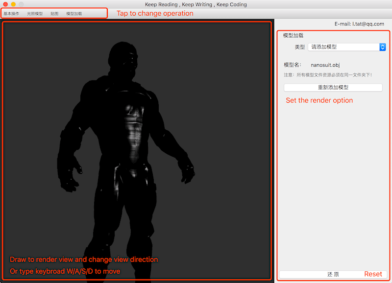
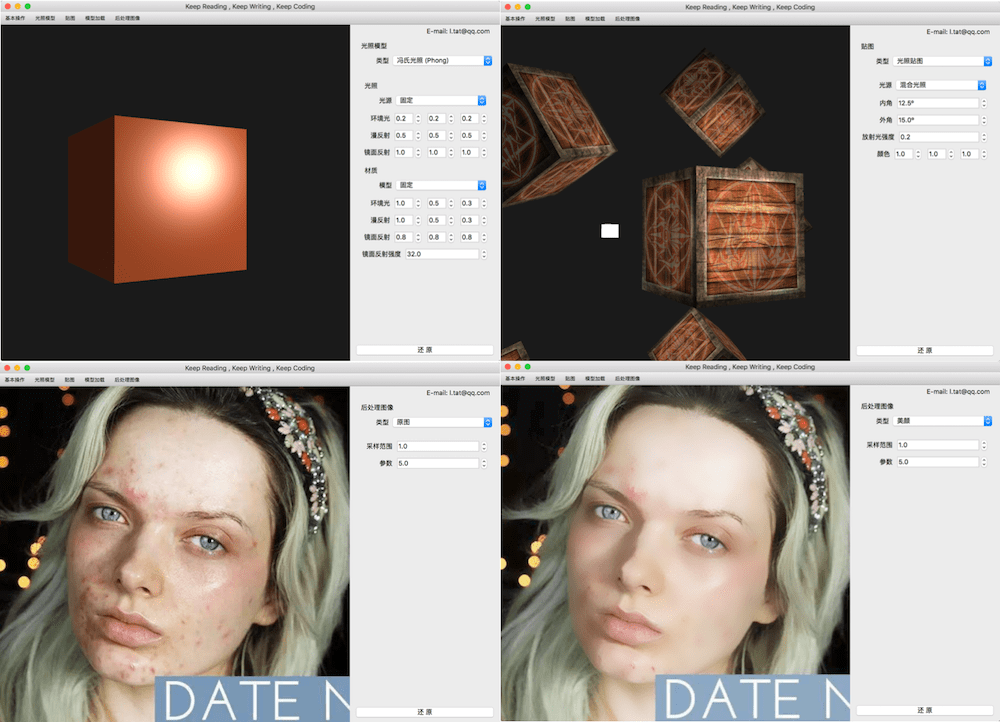

# DrawEasy3D

> 当前版本只支持 OS X 或 macOS 系统

本项目用来对 OpenGL 渲染相关方法以及数字图像处理的相关算法实现的学习和快速测试

- 使用 [QT](https://www.qt.io/) 编写的 UI 界面
- 使用 [*GMath*](https://github.com/CatOnly/GMath) 支持 3D 渲染所需要的透视投影，欧拉角，四元数等数学功能

## 界面介绍

1. 顶栏选择测试渲染的类型
2. 侧边栏选择当前渲染物体的设置选项
3. 左边为绘制区域，通过在这个区域里拖拽鼠标或者使用 A/S/D/W 等按键可以调整绘制区域在 3D 空间中的视野

以下为本项目的软件快照：

